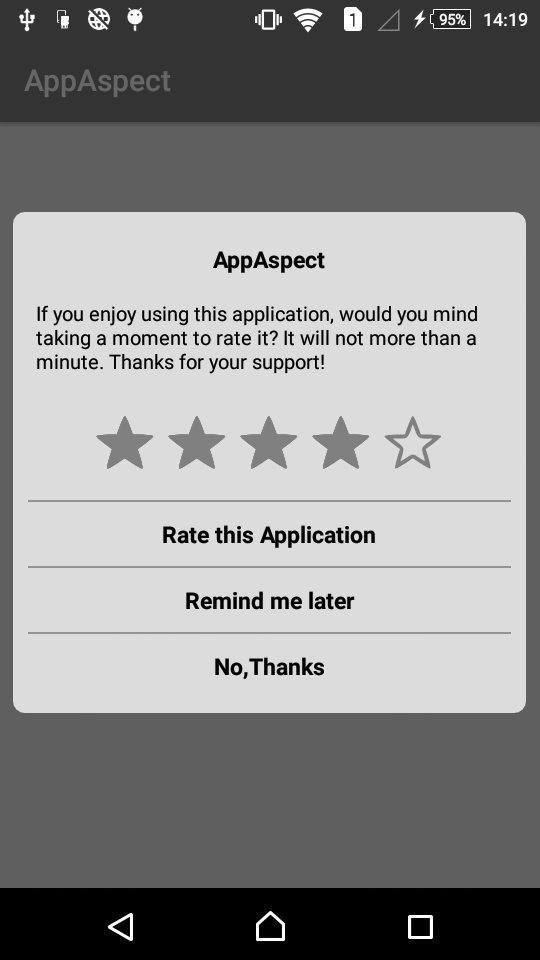
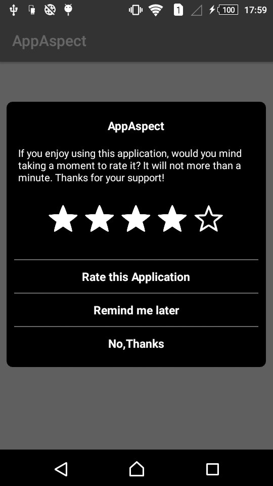
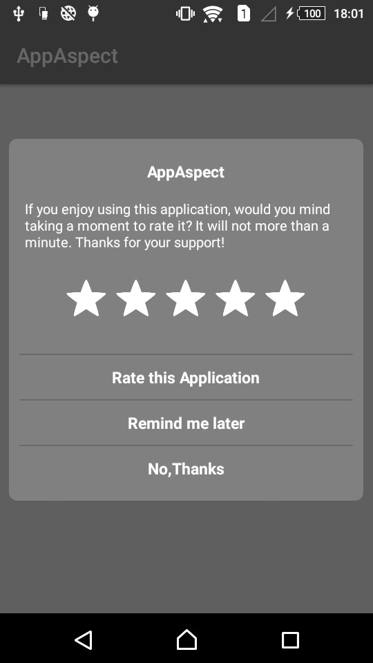
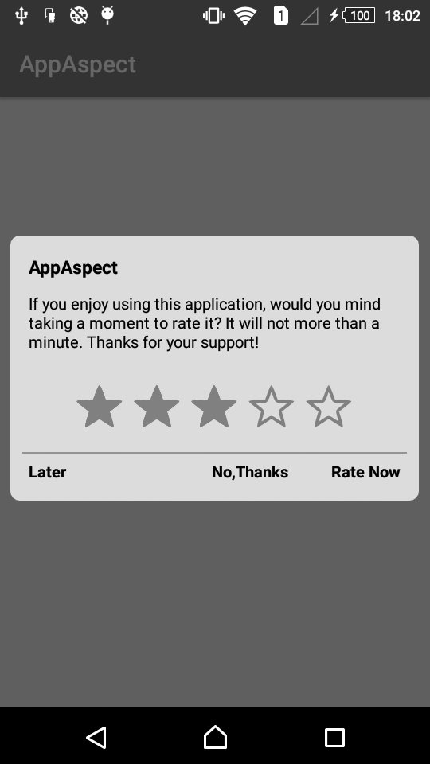
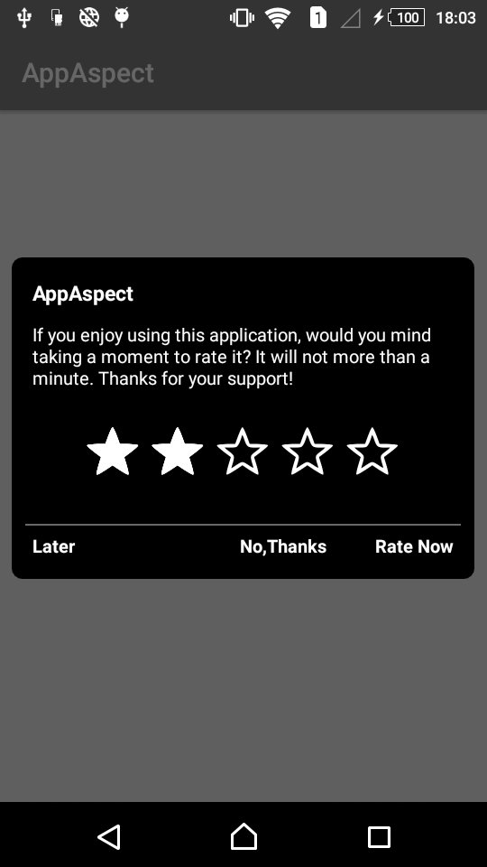
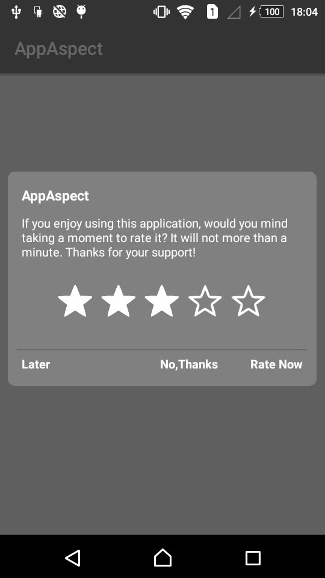

## AndroidRatingLib

AndroidRatingLib is a library that helps developers add a **"Rate My Application"** dialog to their apps.

It's called "AndroidRatingLib" because the dialog has a different behaviour based on the rating given by the user.

If the user gives **4 or 5 stars out of 5**, the user is sent to the *Google Play Store* page to give an actual rating.

If the user gives **3 or less stars out of 5**, the user is asked to *Give App Feedback* to the developer.


## Preview Theme LITE



## Installation

How to

To get a Git project into your build:

Step 1. Add the JitPack repository to your build file 


Add it in your root build.gradle at the end of repositories:

	allprojects {
		repositories {
			...
			maven { url 'https://jitpack.io' }
		}
	}


Step 2. Add the dependency

	dependencies {
	        implementation 'com.github.AppAspectTech:AndroidRatingLib:1.6'
	}


## How to use
To use this library just add this snippet in the `onCreate` of your activity.

The `showAfter(int numbersOfAccess)` method tells the library after how many access the dialog has to be shown.

Example:

```java
RateAppPopUp rateAppPopUp = new RateAppPopUp(this,""); // Set Email ID for App Feedback
        		rateAppPopUp.setTitle("") // Set App name
        			.setHeader_Background_Color(getResources().getColor(R.color.bg_color_black)) // set Header Background Color
                    .setHeader_Text_Color(getResources().getColor(R.color.text_color_white)) // set Header Text Color
                    .setTheme(RateAppPopUp_Data.THEME_LITE) // Set Theme using RateAppPopUp_Data Class
                    .setRatingRestriction(3) // Market opened if a rating >= 3 is selected
                    .showAfter(5); // Set show After how many number of App Access
```
## Features

The library is very simple, just note that :
* When the user click Rate Now or No,Thanks the dialog will not show again.
* When the user click Remind me later the access counter will be reset and the dialog will be shown again after the selected times.

## Theme DARK


## Theme DARK GRAY


## Theme DEFAULT LITE


## Theme DEFAULT DARK


## Theme DEFAULT DARK


## Used by

If you use my library, please tell me at info@appaspect.com
So I can add your app here!


## License
Do what you want with this library.
