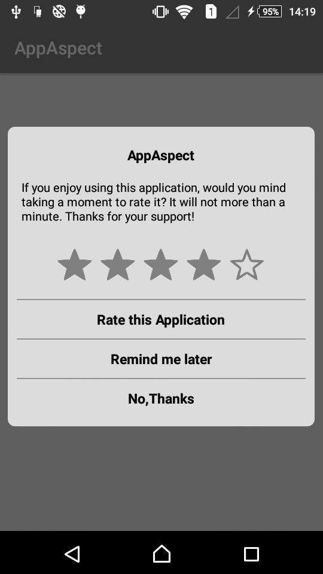

## AndroidRatingLib

AndroidRatingLib is a small library that helps developers add a **"Rate My App"** dialog to their applications.

It's called "AndroidRatingLib" because the dialog has a different behaviour based on the rating given by the user.

If the user gives **4 or 5 stars out of 5**, the user is sent to the *Google Play Store* page to give an actual rating.

If the user gives **3 or less stars out of 5**, the user is asked to *send a bug report* to the developer.


## Preview



## Installation

How to

To get a Git project into your build:

Step 1. Add the JitPack repository to your build file 


Add it in your root build.gradle at the end of repositories:

	allprojects {
		repositories {
			...
			maven { url 'https://jitpack.io' }
		}
	}


Step 2. Add the dependency

	dependencies {
	        implementation 'com.github.AppAspectTech:AndroidRatingLib:1.3'
	}


## How to use
To use this library just add this snippet in the `onCreate` of your activity.

The `showAfter(int numbersOfAccess)` method tells the library after how many access the dialog has to be shown.

Example:

```java
        RateAppPopUp rateAppPopUp = new RateAppPopUp(this,"Email ID");
                rateAppPopUp.setTitle(getString(R.string.app_name)) // Set App name
                        .setTheme(RateAppPopUp_Data.THEME_LITE_GRAY) // Set Theme using RateAppPopUp_Data Class
                        .setRatingRestriction(3) // Market opened if a rating >= 3 is selected
                        .showAfter(5);
```
## Features

The library is very simple, just note that :
* When the user tap OK or NEVER the dialog will not show again
* When the user tap NOT NOW the access counter will be reset and the dialog will be shown again after the selected times.

## Used by

If you use my library, please tell me at info@appaspect.com
So I can add your app here!


## License

Do what you want with this library.
